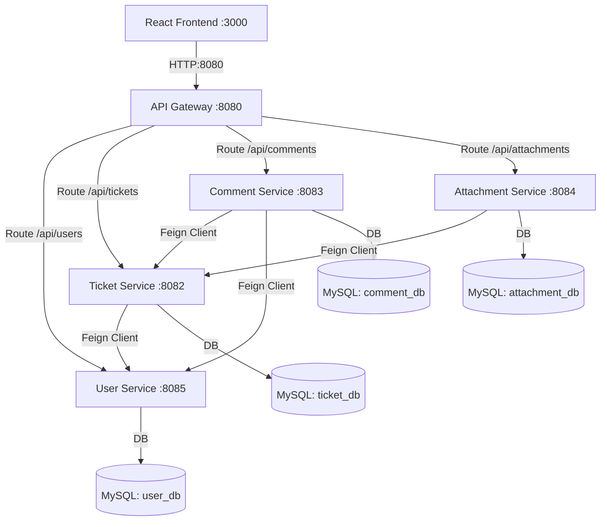

# TicketDesk Microservices Application (POC)

This is a complete full-stack IT Support Ticket Tracker (TicketDesk) designed for practicing local development and cloud microservices concepts. It includes a React frontend, a unified API Gateway, and four distinct Spring Boot microservices that communicate using Spring Cloud OpenFeign, all backed by independent MySQL databases.

## ✦ System Architecture



### 1. Services Port & DB Map

| Service | Port | Database Schema | Primary Role |
| :--- | :---: | :---: | :--- |
| **Frontend Portal** | `3000` (Docker)<br>`5173` (Local) | - | Support desk user portal interface (React + Nginx) |
| **API Gateway** | `8080` | - | Central gateway entrypoint (routes traffic, handles CORS) |
| **User Service** | `8085` | `user_db` | Manages users & support agents |
| **Ticket Service** | `8082` | `ticket_db` | Core ticket lifecycle logic & metrics |
| **Comment Service** | `8083` | `comment_db` | Threaded discussion comments on tickets |
| **Attachment Service** | `8084` | `attachment_db` | Simulated S3 presigned-url uploads & storage |
| **MySQL Database** | `3306` | - | Central database holding isolated schemas |

---

## ✦ Run the Application

### Option A: Direct Docker Compose (Recommended)
You can launch the entire stack (including MySQL, database seeding, the gateway, all 4 microservices, and the React frontend) using a single command:

```bash
# From the project root directory
docker-compose up --build
```
Once initialized, access the frontend user interface at **`http://localhost:3000`** in your browser.

### Option B: Running Locally (Standalone)

#### 1. Pre-requisites
- **MySQL Server** running on port `3306`
- **Java 17 JDK** and **Maven** installed
- **NodeJS** installed

#### 2. Setup Databases
Run the SQL queries in `init.sql` against your local MySQL instance. This will create the databases (`user_db`, `ticket_db`, `comment_db`, `attachment_db`) and seed initial accounts:
- Customers: `john_doe`, `alice_smith`
- Agents: `agent_smith`, `agent_carter`

#### 3. Run Gateway & Microservices (Start in this order)
Navigate to each service directory and launch via Maven:

```bash
# 1. Start User Service (Port 8085)
cd user-service
mvn spring-boot:run

# 2. Start Ticket Service (Port 8082)
cd ../ticket-service
mvn spring-boot:run

# 3. Start Comment Service (Port 8083)
cd ../comment-service
mvn spring-boot:run

# 4. Start Attachment Service (Port 8084)
cd ../attachment-service
mvn spring-boot:run

# 5. Start API Gateway (Port 8080)
cd ../api-gateway
mvn spring-boot:run
```

#### 4. Run Frontend (React)
```bash
cd ../frontend
npm install
npm run dev
```
Open `http://localhost:5173` in your browser.

---

## ✦ Simulating S3 Presigned Upload Workflows
In AWS deployments, files should bypass the application servers and upload directly to an S3 bucket via presigned URLs. This project simulates that exact pattern:
1. When you select a document to upload, the frontend hits `POST :8080/api/attachments/presigned-url`.
2. The **Attachment Service** returns an `uploadUrl` pointing to the mock S3 PUT endpoint and registers a `PENDING` record in the database.
3. The React app performs a direct `PUT` binary request against that mock `uploadUrl`, uploading the file content.
4. The simulator saves the file to `./uploads/` and marks the database record as `ACTIVE`, updating the `fileUrl` for downloads.
